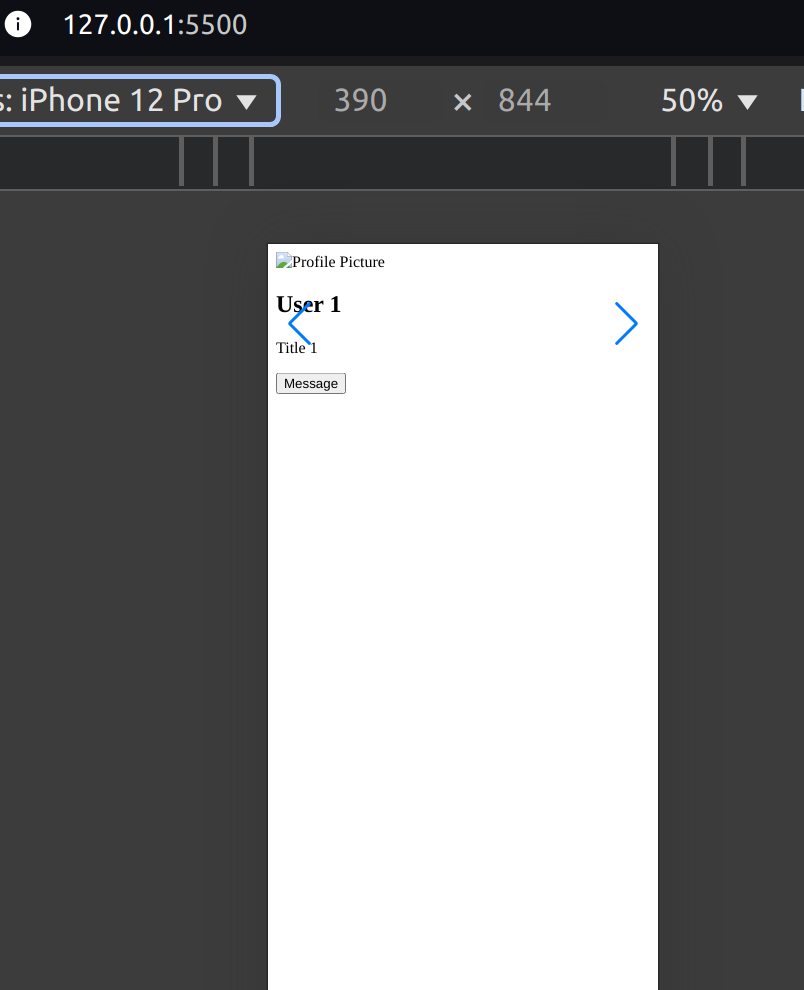
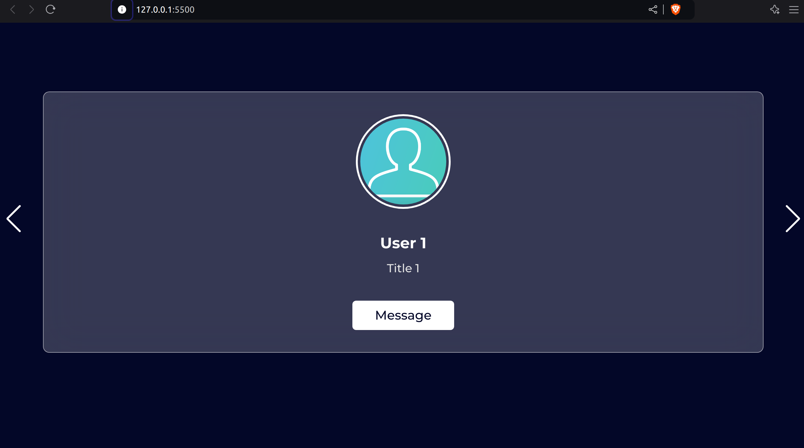

 
#  Responsive Card Slider
Animated Card Slider with glassmorphism effect

In this practice we set up a basic swiper/slider component with multiple items, pagination, and navigation buttons, using the SwiperJS library. 

##  Branch  'dev1'

On this branch we have structured the base swiper/slider skeleton.



##  Branch 'dev2'

On this branch we styled the card slider, and give it a sleek and modern glassmorphism effect.



##  Branch 'dev3'

Lastly we added Javascript code to initialize **'SwiperJS'** and make the card slider functional.

***

##  Branch 'joint', 'QA' and 'main'

To appreciate the final result me merged the three dev branches into 'joint', 'QA' and 'main'.
These branches contains the same changes and the brower will render it as follow:


***


***

#  Code analysis
 
##  HTML File

Here we defined a swiper/slider component with the following elements:

- A container element with the class **'swiper-container'**, which wraps the entire swiper/slider component.

- A div element with the class **'swiper-wraper'**, which contains the swiper/slider items.

- Multiple **'div'** elements with the class **'card-item swiper-slide'**, which represent individual swiper/slider items. Each item contains:

    - An **'img'** element with a profile picture

    - An  **'h2'** element with the name of the user

    - A **'p'** element with the user's profession

    - A **'button'** element with a "message label"

- A **'div'** element with the class **'swiper-pagination'**, which will display pagination indicators for the swiper/slider.

- Two **'div'** elements with the classes **'swiper-slide-button swiper-button-prev'** and **'swiper-slide-button swiper-button-next'**, which will display previous and next navigation buttons for the swiper/slider.

**SwiperJS Script**

We also included a script tag that link to the swiperJS library(version 11) from a CDN, which is commonly used for creating swiper/slider components.

In this section maintain a **narrative style** so the reader can understand and think as the programmer.

##  CSS File

-  **Code section title 1**
>
```css
Put your code here exactly as it is.
```

> Use this text block to describe **relevant facts**, features or functions of your CSS code section that you consider will be useful in understanding **how the style was applied** and its relationship with the HTML code. You **highlight** some parts of this text to **improve its readability**.
***

-  **Code section title 2**
>
```css
Put your code here exactly as it is.
```

> Use this text block to describe **relevant facts**, features or functions of your CSS code section that you consider will be useful in understanding **how the style was applied** and its relationship with the HTML code. You **highlight** some parts of this text to **improve its readability**.
***

-  **Code section title 3**
>
```css
Put your code here exactly as it is.
```

> Use this text block to describe **relevant facts**, features or functions of your CSS code section that you consider will be useful in understanding **how the style was applied** and its relationship with the HTML code. You **highlight** some parts of this text to **improve its readability**.
***

-  **Code section title 4**
>
```css
Put your code here exactly as it is.
```

> Use this text block to describe **relevant facts**, features or functions of your CSS code section that you consider will be useful in understanding **how the style was applied** and its relationship with the HTML code. You **highlight** some parts of this text to **improve its readability**.
***

-  **Code section title 5**
>
```css
Put your code here exactly as it is.
```
> In some cases you might like to explain in a more  detailed manner each part or feature of the code stacking them as follows:
> 
>  **property1** ; Use this space to explain how this property and/or its value affect the final appearance of a specific element and why it is not redundant but necessary.
>  **property2** ; Use this space to explain how this property and/or its value affect the final appearance of a specific element and why it is not redundant but necessary.
>  **property3** ; Use this space to explain how this property and/or its value affect the final appearance of a specific element and why it is not redundant but necessary.
>  **property4** ; Use this space to explain how this property and/or its value affect the final appearance of a specific element and why it is not redundant but necessary.
>  **property5** ; Use this space to explain how this property and/or its value affect the final appearance of a specific element and why it is not redundant but necessary.
***

-  **Code section title 6**
>
```css
Put your code here exactly as it is.
```

> Use this text block to describe **relevant facts**, features or functions of your CSS code section that you consider will be useful in understanding **how the style was applied** and its relationship with the HTML code. You **highlight** some parts of this text to **improve its readability**.
***

-  **Code section title 7**
>
```css
Put your code here exactly as it is.
```

> Use this text block to describe **relevant facts**, features or functions of your CSS code section that you consider will be useful in understanding **how the style was applied** and its relationship with the HTML code. You **highlight** some parts of this text to **improve its readability**.
***

-  **Code section title 8**
>
```css
Put your code here exactly as it is.
```

> Use this text block to describe **relevant facts**, features or functions of your CSS code section that you consider will be useful in understanding **how the style was applied** and its relationship with the HTML code. You **highlight** some parts of this text to **improve its readability**.
***

-  **Code section title 6**
>
```css
Put your code here exactly as it is.
```

> Use this text block to describe **relevant facts**, features or functions of your CSS code section that you consider will be useful in understanding **how the style was applied** and its relationship with the HTML code. You **highlight** some parts of this text to **improve its readability**.
***


***